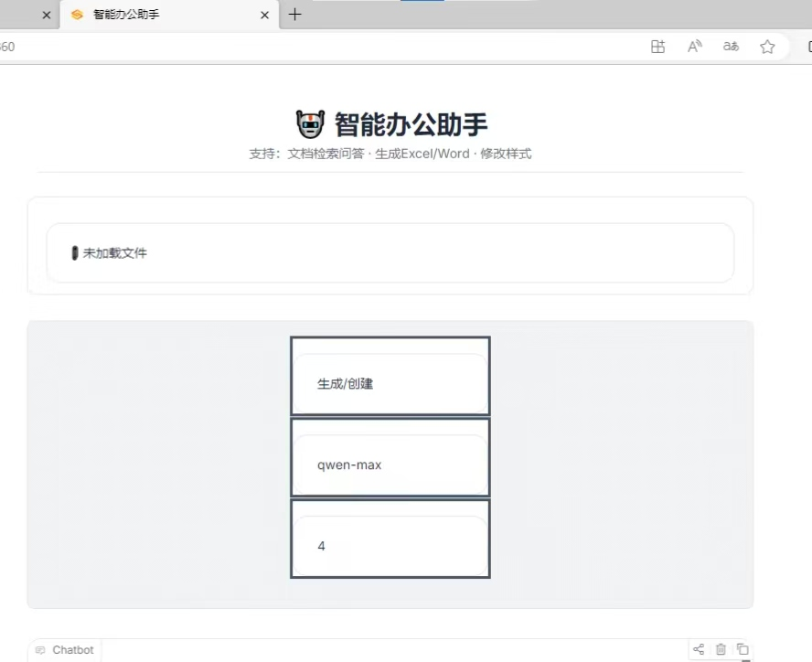
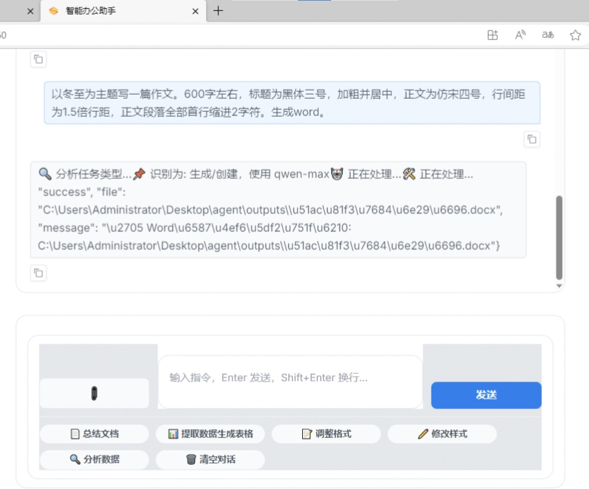
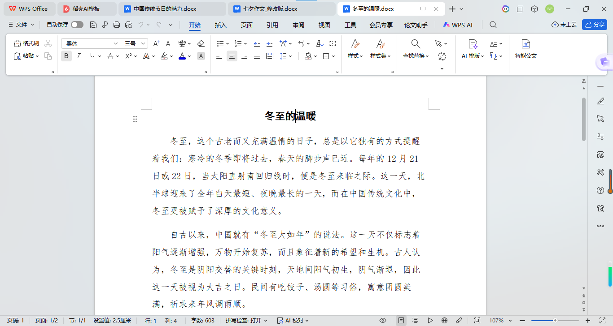
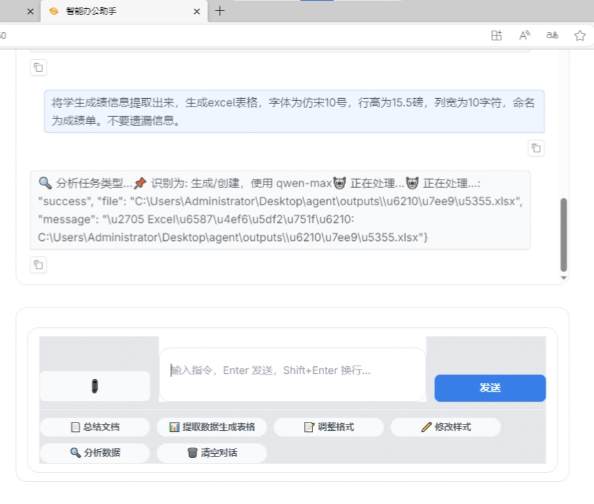
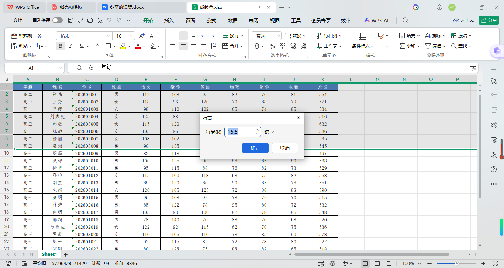
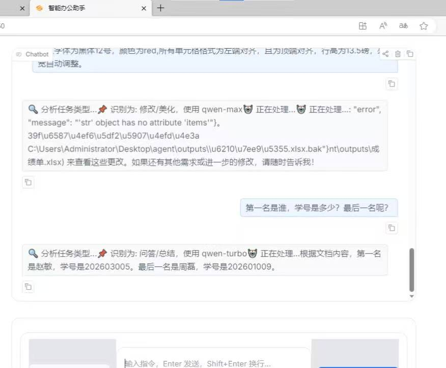
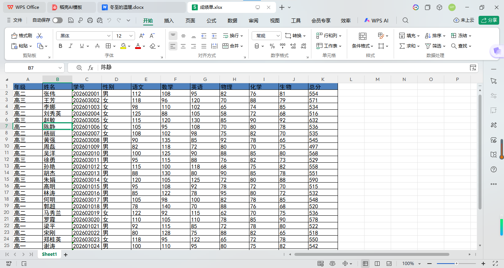

# 🤖 智能办公助手

一个基于通义千问大语言模型(qwen-turbo、qwen-max)的智能文档处理助手，支持文检索档问答、Word/Excel 生成与样式修改。

**（个人练习项目，仅学习交流使用，当前版本：开发中，存在未解决的bug,不建议生产使用）**
## ✨ 功能特性

- 📄 **文档问答**：上传 PDF（OCR识别扫描件）/Word/Excel/TXT/MD，基于 RAG 技术回答问题
- 📝 **生成 Word**：根据需求生成带格式的 Word 文档（支持字号、字体、缩进、行距等）
- 📊 **生成 Excel**：由文本、文档的信息、数据生成带样式的 Excel 表格
- ✏️ ️ **修改样式**：修改 Word/Excel 的字体、字号、颜色、对齐、缩进、行高、列宽等。Excel排序、求和等。
- 💬 **流式输出**：打字机效果，实时显示生成内容，支持一键总结、提取数据、清空会话快捷键
- 🔄 **多用户会话**：每个用户独立会话，互不干扰
## 界面预览

### 主界面


### 文档问答

### 生成 Word


### 生成 excel


### 修改样式 


## 🚀 快速开始

### 环境要求

- Python 3.8+
- 通义千问 API Key（[申请地址](https://dashscope.console.aliyun.com/)）

### 安装

```bash
# 克隆项目
git clone https://github.com/your-username/office-assistant.git
cd office-assistant

# 创建虚拟环境（可选）
python -m venv venv
source venv/bin/activate  # Windows: venv\Scripts\activate

# 安装依赖
pip install -r requirements.txt
配置
bash
# 复制环境变量示例文件
cp .env.example .env

# 编辑 .env，填入你的 API Key
# DASHSCOPE_API_KEY=your-api-key-here
运行
bash
# 本地访问
python app.py

# 公网分享
python app.py --share

# 指定端口
python app.py --port 8080
访问 http://127.0.0.1:7860 即可使用。

📖 使用示例
文档问答
text
上传pdf/word/excel文档后提问："请总结这份文档的主要内容""进行数据分析"
生成 Word
text
"写一篇以中国传统节日为主题的作文，生成 Word 文档，标题为黑体三号，加粗居中，正文为仿宋四号，所有段落首行缩进。行间距为1.5倍。标题颜色为red"
生成 excel
text
上传word后提问，"将文档中关键信息、数据信息提取出来生成excel表格，格式为仿宋12号，行高15.5磅，列宽10字符，所有单元格格式居中。"
修改样式
text
"修改此excel格式为宋体10号，行高15.5磅，列宽10字符，所有单元格格式居中。"
🛠️ 技术架构
组件	技术
前端框架	Gradio 6.0
大语言模型	通义千问 (qwen-turbo/qwen-max)
向量检索	FAISS
文档解析	PyMuPDF / pdfplumber / python-docx
工具调用	qwen-agent
会话管理	内存字典 + Session ID

🛠️ 核心功能模块
文档解析引擎：多策略 PDF 解析（PyMuPDF → pdfplumber → OCR 兜底），Word/Excel/TXT 统一读取，内置文本清洗
RAG 检索：DashScope text-embedding-v3 向量模型 + FAISS 本地向量库，分段相似度检索
工具集：基于 Qwen-Agent Function Call，支持生成/修改 Word/Excel 及表格数据处理
会话管理：UUID 隔离会话，自动清理超时（1 小时），独立存储对话与文件
前端界面：Gradio 仿 DeepSeek 极简单栏布局，流式输出，自适应移动端，自动渲染下载链接
📁 目录结构
text
├── app.py              # 主程序
├── requirements.txt    # 依赖清单
├── .env.example        # 环境变量示例
├── outputs/            # 生成文件存储
├── uploads/            # 上传文件存储
└── temp/               # 临时文件存储
📄 License

🤝 贡献
欢迎提交 Issue 和 Pull Request！

📧 联系方式
作者：Ll-st9

如有问题可在Issues留言沟通。此为练习项目存在优化空间和未解决的bug。

 6. `LICENSE`

MIT License

Copyright (c) 2026 LI-st9

Permission is hereby granted, free of charge, to any person obtaining a copy
of this software and associated documentation files (the "Software"), to deal
in the Software without restriction, including without limitation the rights
to use, copy, modify, merge, publish, distribute, sublicense, and/or sell
copies of the Software, and to permit persons to whom the Software is
furnished to do so, subject to the following conditions:

The above copyright notice and this permission notice shall be included in all
copies or substantial portions of the Software.

THE SOFTWARE IS PROVIDED "AS IS", WITHOUT WARRANTY OF ANY KIND, EXPRESS OR
IMPLIED, INCLUDING BUT NOT LIMITED TO THE WARRANTIES OF MERCHANTABILITY,
FITNESS FOR A PARTICULAR PURPOSE AND NONINFRINGEMENT. IN NO EVENT SHALL THE
AUTHORS OR COPYRIGHT HOLDERS BE LIABLE FOR ANY CLAIM, DAMAGES OR OTHER
LIABILITY, WHETHER IN AN ACTION OF CONTRACT, TORT OR OTHERWISE, ARISING FROM,
OUT OF OR IN CONNECTION WITH THE SOFTWARE OR THE USE OR OTHER DEALINGS IN THE
SOFTWARE.
